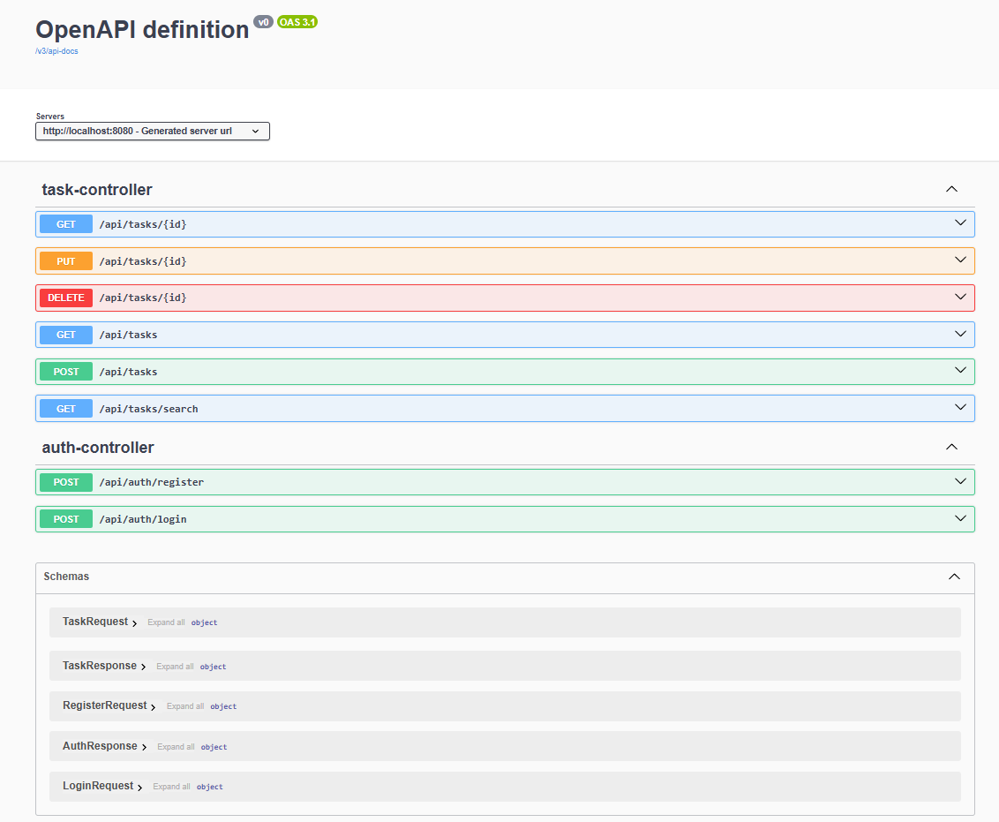
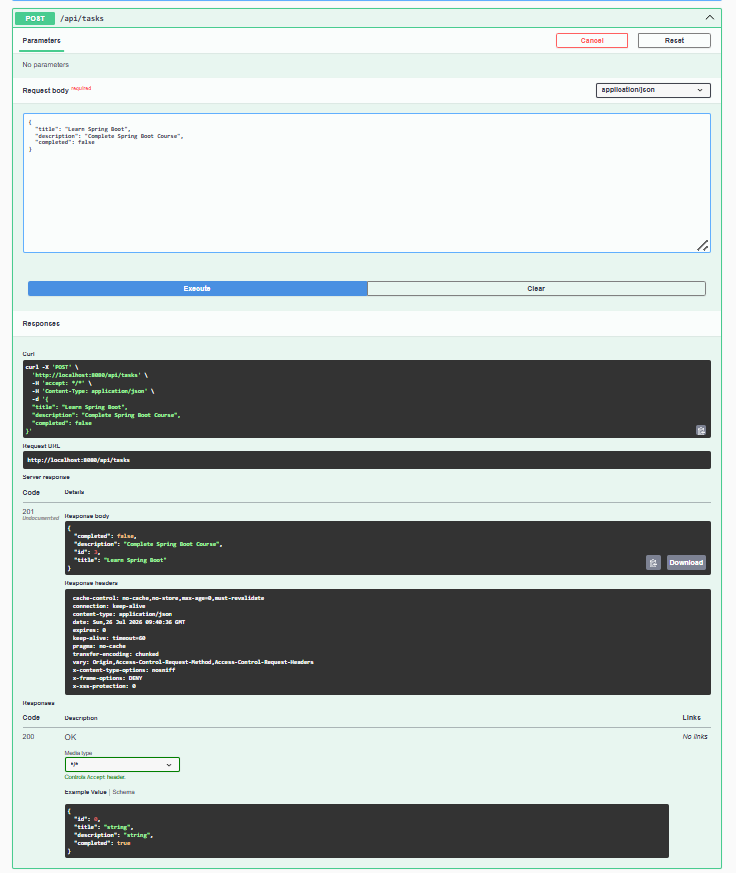
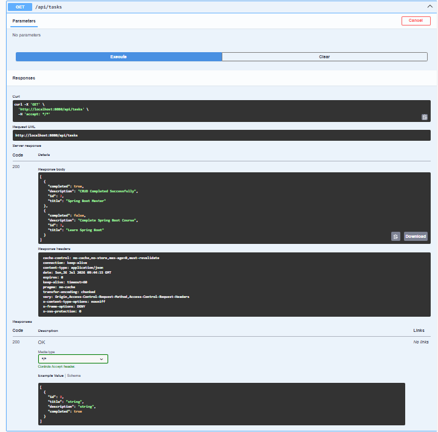
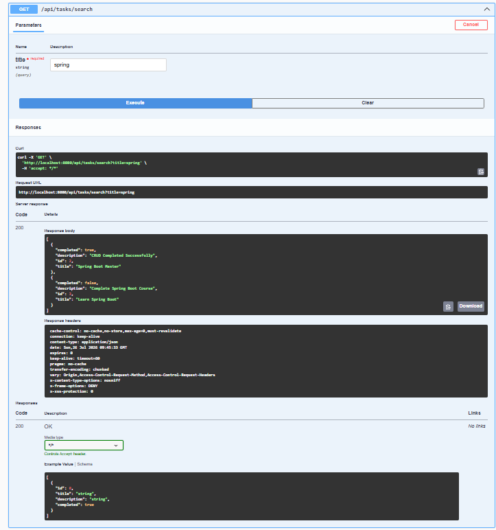
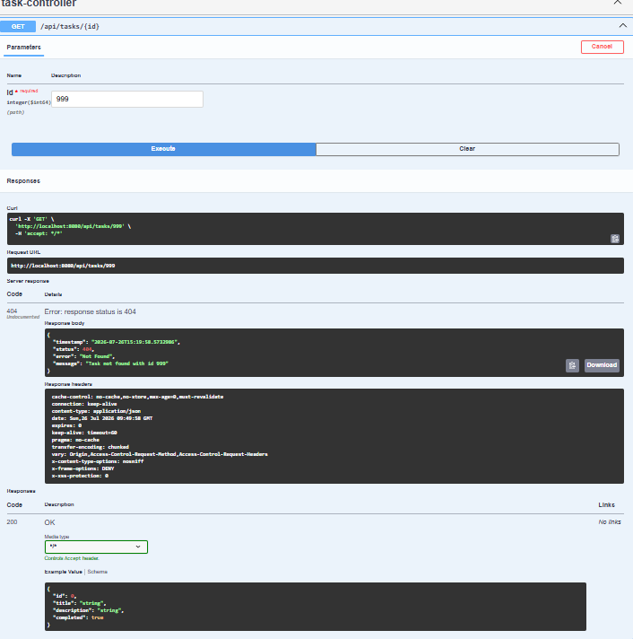
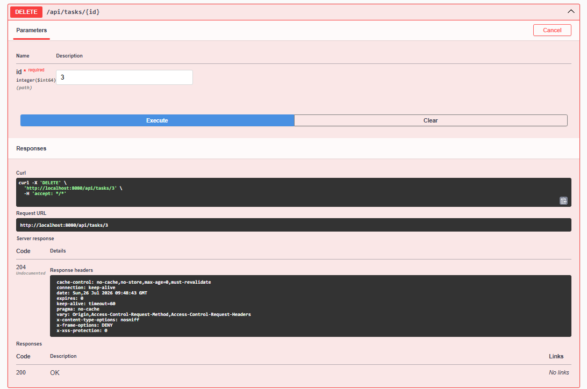

# 🚀 Task Manager REST API

A RESTful Task Management application built using **Java, Spring Boot, Spring Data JPA, Hibernate, and MySQL**.

---

## 📌 Features

- ✅ Create Task
- ✅ Get All Tasks
- ✅ Get Task By ID
- ✅ Update Task
- ✅ Delete Task
- ✅ Search Task By Title
- ✅ Input Validation
- ✅ Global Exception Handling
- ✅ Logging (SLF4J)
- ✅ Swagger API Documentation

---

## 🛠️ Tech Stack

- Java 17
- Spring Boot
- Spring Data JPA
- Hibernate
- MySQL
- Maven
- Swagger OpenAPI
- Postman
- Git & GitHub

---

## 📂 Project Structure

```
src
 └── main
     ├── controller
     ├── service
     ├── repository
     ├── entity
     ├── dto
     ├── exception
     ├── config
```

---

## 📡 REST API Endpoints

| Method | Endpoint | Description |
|--------|----------|-------------|
| POST | /api/tasks | Create Task |
| GET | /api/tasks | Get All Tasks |
| GET | /api/tasks/{id} | Get Task By ID |
| PUT | /api/tasks/{id} | Update Task |
| DELETE | /api/tasks/{id} | Delete Task |
| GET | /api/tasks/search?title=spring | Search Tasks |

---

## 📷 Screenshots

### Swagger UI



### Create Task



### Get All Tasks



### Search Task



### Validation



### Task Not Found



---

## ▶️ How to Run

1. Clone the repository

```bash
git clone https://github.com/YOUR_USERNAME/task-manager-rest-api.git
```

2. Configure MySQL

3. Update `application.properties`

4. Run

```bash
./mvnw spring-boot:run
```

---

## 🔮 Future Enhancements

- JWT Authentication
- Pagination & Sorting
- Docker Support
- Deployment

---

## 👩‍💻 Author

**Bhavitha Marikeeri**